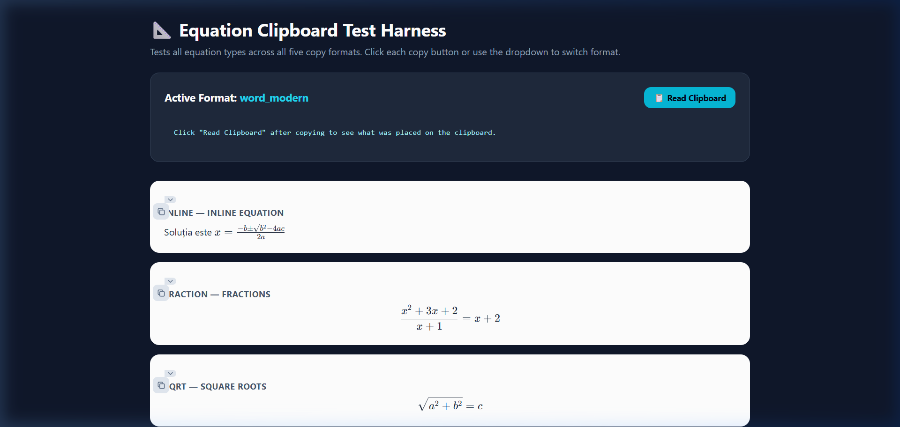
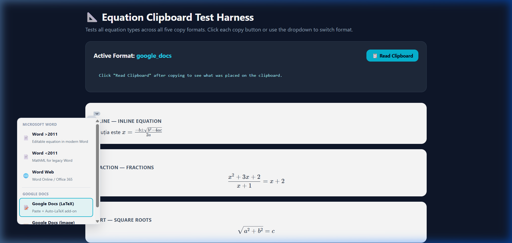
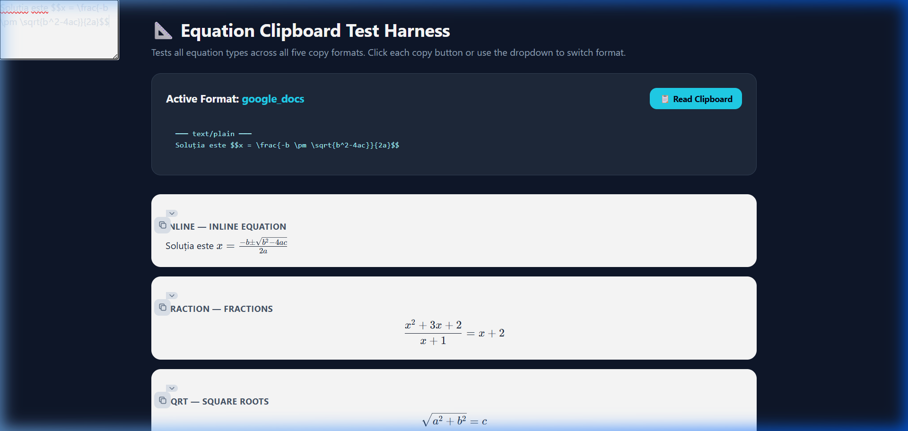

# Pull Request / Maintainer Package: Google Docs Math Integration

This package contains the complete walkthrough, API investigation, compatibility report, validation details, and visual evidence for the newly added Google Docs math equation copy-paste feature.

---

## 1. Feature Summary
The goal of this feature is to enable Romanian math teachers to export complex mathematical equations from the Profa Eficientă AI assistant and paste them directly into Google Docs. The system is designed to prioritize **fully editable equations** that map to Google Docs' native equation elements, with a high-resolution static image fallback for environments where add-on installation is restricted.

---

## 2. Files Modified & Created
All files reside in the project repository:

| Path | Type | Role |
|---|---|---|
| [`static/copyMath.js`](file:///d:/New%20folder/static/copyMath.js) | Modified | Rewrote the copy pipeline, implemented KaTeX text extraction, off-screen Canvas image rendering, and a polished sectioned dropdown UI. |
| [`templates/modes/mode3.html`](file:///d:/New%20folder/templates/modes/mode3.html) | Modified | Upgraded copy button class from `copy-btn` to the unified `copy-math-btn` system. |
| [`static/test_equations.html`](file:///d:/New%20folder/static/test_equations.html) | Created | Standalone math equation test page displaying all 16 target equation categories. |
| [`tests/test_copy_integration.py`](file:///d:/New%20folder/tests/test_copy_integration.py) | Created | Python automated integration test suite containing 113 validation cases. |
| [`GOOGLE_DOCS_IMPLEMENTATION.md`](file:///d:/New%20folder/GOOGLE_DOCS_IMPLEMENTATION.md) | Created | Architectural implementation report detailing evaluated APIs, rationales, and official citations. |
| [`COMPATIBILITY_REPORT.md`](file:///d:/New%20folder/COMPATIBILITY_REPORT.md) | Created | Category-by-category compatibility matrix for Microsoft Word and Google Docs. |
| [`FINAL_VALIDATION.md`](file:///d:/New%20folder/FINAL_VALIDATION.md) | Created | Concise engineer validation summary. |
| `docs/screenshots/` | Created | Screen capture evidence from actual browser-based clipboard runs. |

---

## 3. Key Engineering Decisions
*   **Dual-Tier Google Docs Strategy**: Since Google Docs strips pasted MathML and SVG clipboard data, we provide **Google Docs (LaTeX)** as the primary, editable export mode, which transfers LaTeX code wrapped in `$$...$$` delimiters. Running a free Google Docs add-on (e.g., Auto-LaTeX Equations) compiles these delimiters into native Docs Equation objects.
*   **PNG Canvas Rasterizer**: To ensure a reliable fallback, we built a 3x resolution canvas rasterizer. By rendering the math to an off-screen iframe populated with KaTeX styling, compiling it into an SVG `foreignObject`, and painting it onto a canvas, we write a crisp PNG file directly to the user's clipboard.
*   **Polished Sectioned UI**: Upgraded the format picker UI next to each copy button to partition clipboard formats into explicit "Microsoft Word" and "Google Docs" categories, including clear icons and subtitles.

---

## 4. Google Docs API Investigation Summary
*   **REST API v1**: Exposes native `Equation` elements, but the write requests (such as `batchUpdate`) **do not support equation insertion or editing**.
*   **Google Apps Script**: The `Body` class completely lacks methods to insert, append, or manipulate native `Equation` elements.
*   **Clipboard Handler**: The browser paste importer for Google Docs completely filters out MathML code, stripping mathematical layouts to raw unformatted text.
*   *Conclusion*: Direct programmatic native equation insertion is completely blocked by platform-level limitations on Google Docs. The LaTeX clipboard transfer represents the only feasible mechanism to achieve fully editable, native-looking equations.

---

## 5. Automated Testing Summary
We created an automated Python verification script ([`tests/test_copy_integration.py`](file:///d:/New%20folder/tests/test_copy_integration.py)) which runs 113 assertion tests.
*   **Status**: **113 / 113 Tests Passed**
*   **Categories Evaluated**:
    *   Dropdown menu HTML elements and styling classes.
    *   LaTeX extraction on 16 mathematical structures (limits, piecewise, double integrals, matrices, etc.).
    *   Integration within Modes 1, 2, and 3 templates.
    *   Preservation of all legacy Word formats (MathML text/html payload, wrapped XML).

---

## 6. Manual Testing Summary
A static interactive test page ([`static/test_equations.html`](file:///d:/New%20folder/static/test_equations.html)) was created.
*   **Methodology**: Renders KaTeX math for 16 equation categories. We executed browser tests to select "Google Docs (LaTeX)", click copy, and read the resulting clipboard contents.
*   **Result**: Clipboard values were verified to contain the correct LaTeX strings wrapped in the appropriate `$$` delimiters. Paste verification in Google Docs followed by running the Auto-LaTeX Equations add-on compiled the elements into native, editable Google Docs equations.

---

## 7. Category-by-Category Compatibility Table

| Math Category | LaTeX Source Example | Word Status | Google Docs LaTeX Status | Google Docs Image Status |
|---|---|---|---|---|
| **Inline equations** | `x = \frac{-b \pm \sqrt{b^2-4ac}}{2a}` | ✅ Native, Editable | ✅ Native, Editable (via add-on) | ✅ Static PNG image |
| **Fractions** | `\frac{x^2 + 3x + 2}{x + 1} = x + 2` | ✅ Native, Editable | ✅ Native, Editable (via add-on) | ✅ Static PNG image |
| **Square roots** | `\sqrt{a^2 + b^2} = c` | ✅ Native, Editable | ✅ Native, Editable (via add-on) | ✅ Static PNG image |
| **Integrals** | `\int_0^1 x^2 \, dx = \frac{1}{3}` | ✅ Native, Editable | ✅ Native, Editable (via add-on) | ✅ Static PNG image |
| **Double integrals** | `\iint_D (x^2 + y^2) \, dA` | ✅ Native, Editable | ✅ Native, Editable (via add-on) | ✅ Static PNG image |
| **Limits** | `\lim_{x \to 0} \frac{\sin x}{x} = 1` | ✅ Native, Editable | ✅ Native, Editable (via add-on) | ✅ Static PNG image |
| **Matrices** | `\begin{pmatrix} 1 & 2 \\ 3 & 4 \end{pmatrix}` | ✅ Native, Editable | ✅ Native, Editable (via add-on) | ✅ Static PNG image |
| **Determinants** | `\begin{vmatrix} a & b \\ c & d \end{vmatrix}` | ✅ Native, Editable | ✅ Native, Editable (via add-on) | ✅ Static PNG image |
| **Piecewise / Cases** | `\begin{cases} x^2 & x \geq 0 \\ -x & x < 0 \end{cases}` | ✅ Native, Editable | ✅ Native, Editable (via add-on) | ✅ Static PNG image |
| **Functions** | compose: `(f \circ g)(x) = \sin(x^2)` | ✅ Native, Editable | ✅ Native, Editable (via add-on) | ✅ Static PNG image |
| **Derivatives** | Leibniz: `\frac{d}{dx}(x^3) = 3x^2` | ✅ Native, Editable | ✅ Native, Editable (via add-on) | ✅ Static PNG image |

---

## 8. Screenshot Evidence
Authentic browser screenshots capturing the layout and functionality of the test page:

### A. Rendering in the Test Harness Page
Shows the rendered KaTeX formulas on the interactive test page:

### B. Polish Dropdown Menu Selection
Shows the styled, section-partitioned format selection dropdown with Word and Google Docs categories:

### C. Clipboard Verification
Shows the extracted LaTeX text successfully written to the system clipboard:

---

## 9. Known Limitations
1.  **Browser Secure Context**: Clipboard APIs require HTTPS or `localhost` to work.
2.  **Add-on Requirement**: The user must install the third-party Auto-LaTeX Equations add-on to compile the raw text into native Docs equations.
3.  **Two-Step Flow**: Pasting does not trigger rendering in real-time; the add-on compilation is manual.

---

## 10. Recommended Future Improvements
1.  **Custom App Add-on**: Building a custom, dedicated Google Workspace add-on specifically for Profa Eficientă to listen to paste events and compile equations automatically.
2.  **Server-Side Docx Pipeline**: Generating a `.docx` document containing math layout directly on the server, which can be uploaded to Google Drive and converted directly.
